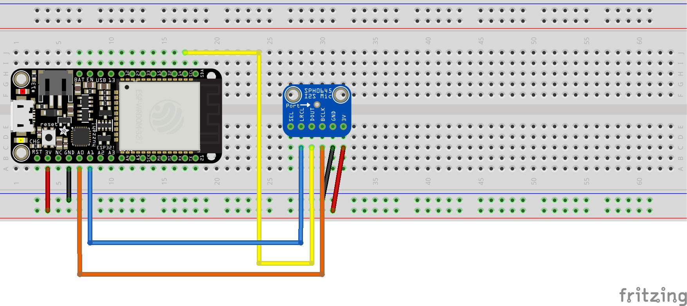

# stm32-i2s-beep-detection
Circuit based on STM32 (Adafruit HUZZAH32 – ESP32 Feather Board) and a digital
output (I2S) MEMS microphone (INMP441 or SPH0645LM4H) that detects beeping washing machine or
dryer and sends notification to smartphone.

## Dependencies

* Requires arduinoFFT, A library for implementing floating point Fast Fourier Transform calculations on Arduino (can be integrated using the Arduino IDE Library Manager )
https://www.arduino.cc/reference/en/libraries/arduinofft/ 
* If you like to use [Pushover app](https://pushover.net/) on a smartphone for 
  notification, you can manually integrate this library: https://github.com/ArduinoHannover/Pushover
* Other ways of notifications are also possible (e.g. [Node-RED](https://nodered.org/) ) 

## Parts

* ESP32 board with I2S onboard (e.g. [Adafruit HUZZAH32 – ESP32 Feather Board](https://www.adafruit.com/product/3405))
* Digital microphone (e.g. INMP441 or SPH0645LM4H)

## Motivation

If your washing machine or dryer is located in the basement, you often are
unsure if it already has finished its work. **Continuous nagging questions** of
your partner like "Did the washing machine already beep" can drive you crazy.
With this solution, you can install a small circuit in the basement next
to the washing machine, and let it send you (and your partner) a push
notification on the smartphone as soon as the washing machine has
finished.

## Wiring
I2S_WS <--> D25

I2S_SD <--> D22

I2S_SCK <--> D26

Note: I had some problem with selecting the **left** channel for the INMP441- Either the 
data sheets are wrong, or the manufacturer does not stick to it for some versions of it.

## How it works

STM32 microcontrollers already has Wi-Fi on board, so it is easy to connect
to the local WLAN as soon as the beeping of the washing machine is detected.

The microphone uses a sample rate of 44100Hz and sends the audio samples
to the STM32 using the [I2S protocol](https://docs.espressif.com/projects/esp-idf/en/v4.1/api-reference/peripherals/i2s.html)

The STM32 uses a library to do a [Fast Fourier Transformation](https://en.wikipedia.org/wiki/Fast_Fourier_transform)
and returns the most dominant frequency (peek frequency).

If this peak frequency is stable more than 500ms, then is can be interpreted as a
beep of the washing machine, and the notification can be triggered.

## Room for improvement

* Could add code to distinguish the beep codes (frequency, rhythm of beeep) 
  of several machines, enabling to distinguish between washing machine and dryer.
* Optimization of sample rate and number of samples for FFT analysis.  

## Kudos

* DroneBot Workshop https://dronebotworkshop.com/esp32-i2s/
* Arduino Hannover User Group: https://github.com/ArduinoHannover/Pushover

